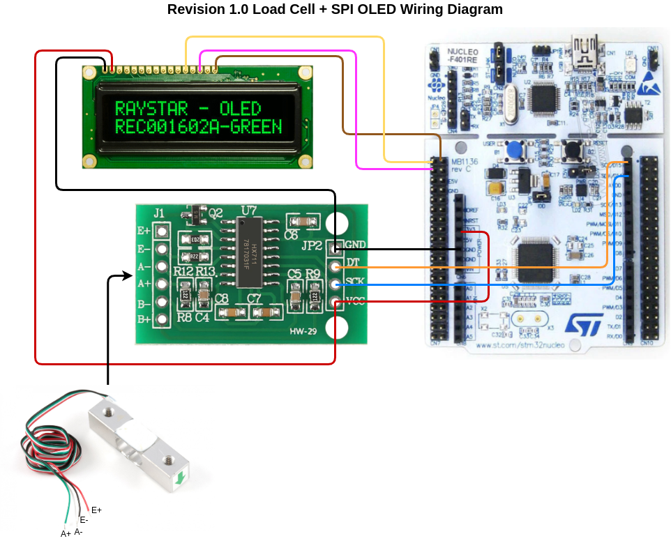
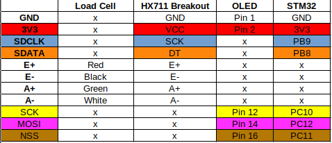

# **Load Cell Code + Schematics**

## **Revision 1.0**
Last updated: Feb 18th, 2022

* This code reads 24-bit `HX711` ADC samples at a 10 Hz sampling rate
    * 10 Hz or 80Hz data rate configurable via `main.c`:
    ```
    load_cell_init(HZ10, CHA_128_GAIN);
    //load_cell_init(HZ80, CHA_128_GAIN);
    ```
* Uses input Channel A of the HX711 with gain of 128
    * Gain is configurable via `main.c` for 64x or 128x gain
    ```
    load_cell_init(HZ10, CHA_128_GAIN);
    //load_cell_init(HZ10, CHA_64_GAIN);
    ```
    * Gain of 32 `possible` for requiring of hardware to Channel B
    and software modification

* See the wiring diagram below for more details:



* The table below is color-coded to match the visual above and summarizes the connections (and what pins they are on the MCU)


* Converts the sample data from a 24-bit two's complement number
to a 32-bit two's complement number

